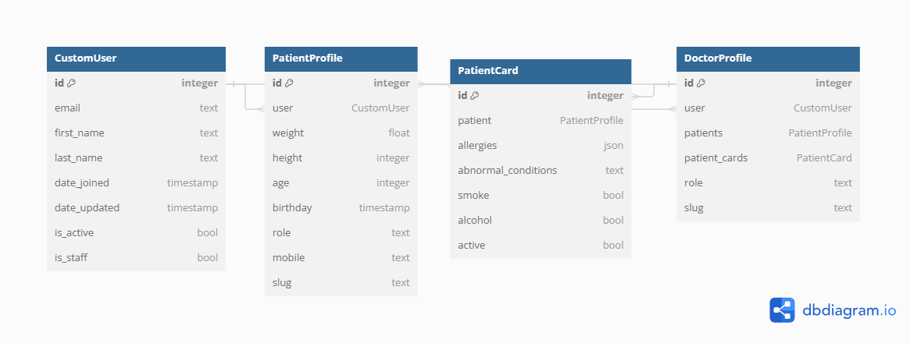
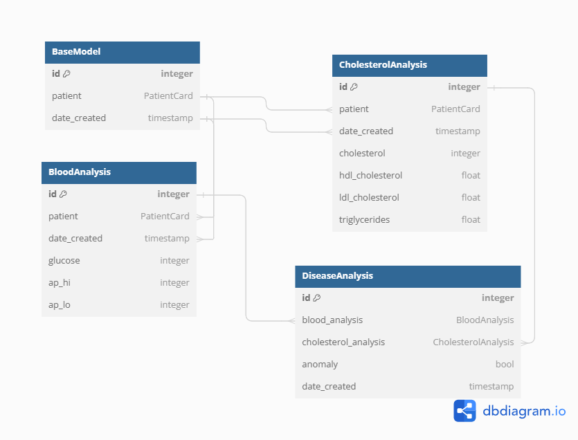
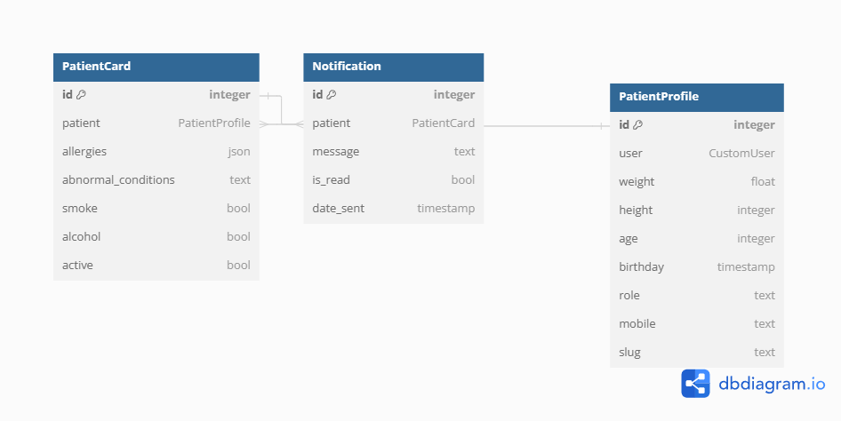
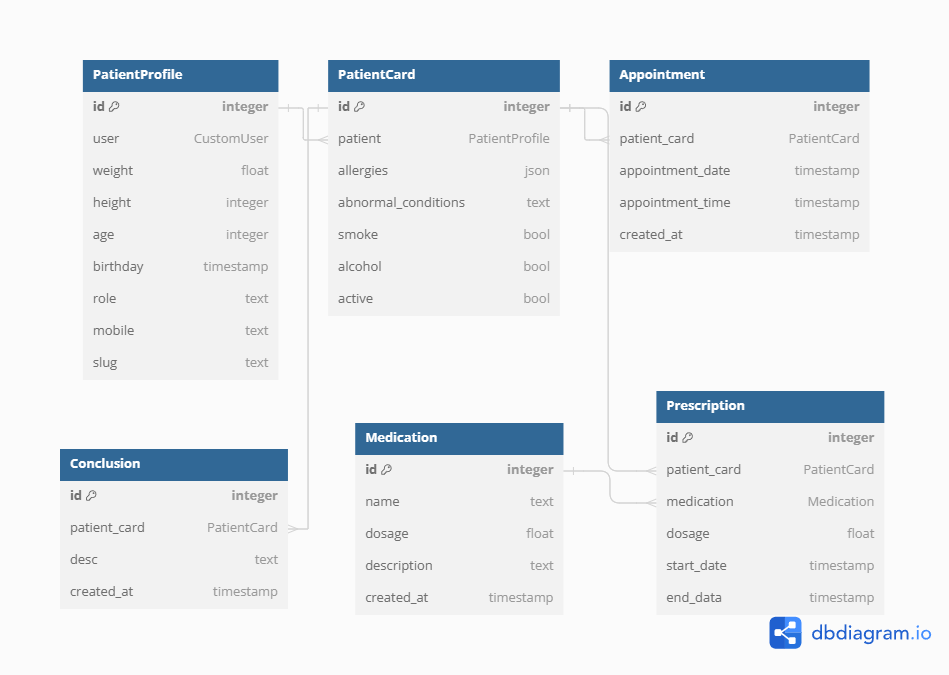

<p align='center'>


</p>

# Setup
First, clone the repository:

```sh
$ git clone https://github.com/Victorious-hub/Patient_Monitoring_App.git
$ cd medtech
```

Create virtual environment and activate:

- Install virtualenv using pip:
```sh
$ pip install virtualenv
```
- For Linux and macOS:

```sh
$ python3 venv -m <name_of_your_venv>
$ source venv/bin/activate
```

- For Windows:
```sh
$ python venv -m <name_of_your_venv> 
$ .\venv\Scripts\activate
```
! For deactivating virtualenv, just write:
```sh
$ deactivate
```

Note: if you haven't installed docker on your machine, follow the links:
- Linux: https://docs.docker.com/engine/install/ubuntu/
- Windows https://docs.docker.com/desktop/install/windows-install/ and setup WSL https://learn.microsoft.com/en-us/windows/wsl/install
- macOS https://docs.docker.com/desktop/install/mac-install/

Install all requirements from requirements.txt file:
```sh
$ pip freeze > requirements.txt
$ pip install -r requirements.txt
```

In -medtech- current directory, build and run you docker-compose images:
```sh
$ docker-compose up --build 
```

# Project overview

Patient Cardio Vascular Disease monitoring is just a simple application. The main goal is to easy track doctor's patients with their potential CV problems or anomalies, provide some treatment, make their life better and just be on air). For searching for CV anomalies, this app includes some machine learning models that were trained on the CVD dataset.
- Cardiovascular Disease dataset https://www.kaggle.com/datasets/sulianovacardiovascular-disease-dataset

It's also a good choice for patient to track it's analyses, doctor info, notification, condition and treat proccess

## Project stack
It's a backend part of my application. It includes:
- Python
- Jupyter notebook analysis
- REST architecture
- Django Rest Framework
- Docker/docker-compose
- PostgreSQL
- Celery/Celery-Flow
- Redis
- nginx

## Models

### User models

### CustomUser Model
- id: integer [primary key]
- email: text
- first_name: text
- last_name: text 
- date_joined: timestamp
- date_updated:timestamp
- is_active: bool
- is_staff: bool
### PatientProfile Model
- id: integer [primary key]
- user: CustomUser
- weight: float
- height: integer
- age:  integer
- birthday: timestamp
- role: text
- mobile: text
- slug: text
### DoctorProfile Model
- id: integer [primary key]
- user: CustomUser
- patients: PatientProfile
- patient_cards: PatientCard
- role: text
- slug: text
### PatientCard Model
- id integer: [primary key]
- patient: PatientProfile
- allergies: json
- abnormal_conditions: text
- smoke: bool
- alcohol: bool
- active: bool

### Analysis models
 
### BaseModel
- id integer: [primary key]
- patient: PatientCard
- date_created: timestamp
### BloodAnalysis(BaseModel) Model
- id integer [primary key]
- glucose integer
- ap_hi integer
- ap_lo integer
### CholesterolAnalysis Model
- id integer: [primary key]
- cholesterol integer
- hdl_cholesterol float
- ldl_cholesterol float
- triglycerides float
### DiseaseAnalysis Model
- id integer: [primary key]
- blood_analysis BloodAnalysis [ref: > - BloodAnalysis.id]
- cholesterol_analysis CholesterolAnalysis [ref: > CholesterolAnalysis.id]
- anomaly bool
- date_created timestamp

### Notification models
 

### Notification Model
- id integer: [primary key]
- patient: PatientCard [ref: > PatientCard.id]
- message: text
- is_read: bool
- date_sent: timestamp

### Treatment models
 

### Appointment Model
- id: integer [primary key]
- patient_card: PatientCard [ref: > PatientCard.id]
- appointment_date: timestamp
- appointment_time: timestamp
- created_at: timestamp
### Medication Model
- id: integer [primary key]
- name: text
- dosage: float
- description: text
- created_at: timestamp
### Prescription Model
- id: integer [primary key]
- patient_card: PatientCard [ref: > PatientCard.id]
- medication: Medication [ref: > Medication.id]
- dosage: float
- start_date: timestamp
- end_data: timestamp
### Conclusion Model
- id integer [primary key]
- patient_card PatientCard [ref: > PatientCard.id]
- desc text
- created_at timestamp

